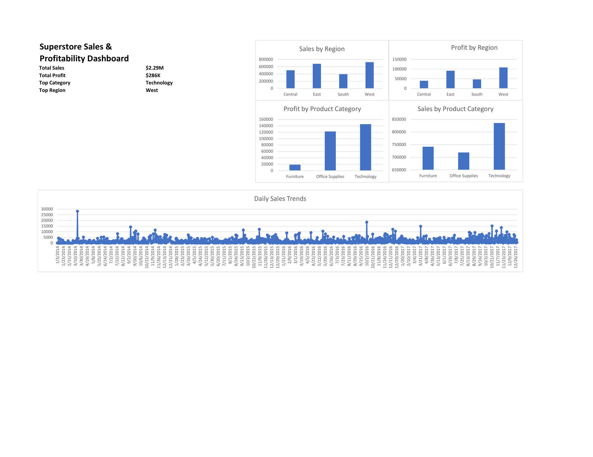

# Superstore Sales Dashboard

## Project Overview
This project analyzes retail sales and profitability data from a Superstore dataset using Excel dashboards, pivot tables, charts, and SQL-based business analysis.

The goal of the project was to identify key business insights related to:
- regional sales performance
- product category profitability
- overall sales trends
- high-performing business segments

---

## Tools Used
- Microsoft Excel
- Pivot Tables
- Pivot Charts
- SQL
- GitHub

---

## Dashboard Features
The dashboard includes:
- Total Sales KPI
- Total Profit KPI
- Top Performing Region
- Top Product Category
- Sales by Region
- Profit by Region
- Sales by Product Category
- Profit by Product Category
- Daily Sales Trend Analysis

---

## SQL Analysis
SQL queries were created to analyze:
- total sales and profit
- regional performance
- category-level profitability
- top-performing products
- business sales trends

The SQL queries are included in:
`superstore-analysis-queries.sql`

---

## Files Included

| File | Description |
|---|---|
| `superstore-sales-analytics.xlsx` | Full Excel workbook |
| `superstore-dashboard.pdf` | Exported dashboard view |
| `dashboard-preview.png` | Dashboard preview image |
| `superstore-analysis-queries.sql` | SQL business analysis queries |

---

## Dashboard Preview

---

## Key Insights
- The West region generated the highest overall sales and profit.
- Technology was the top-performing product category.
- Sales performance increased significantly during later periods in the dataset.
- Certain categories produced strong sales but lower profitability.

---

## Author
Imaad Adeel
